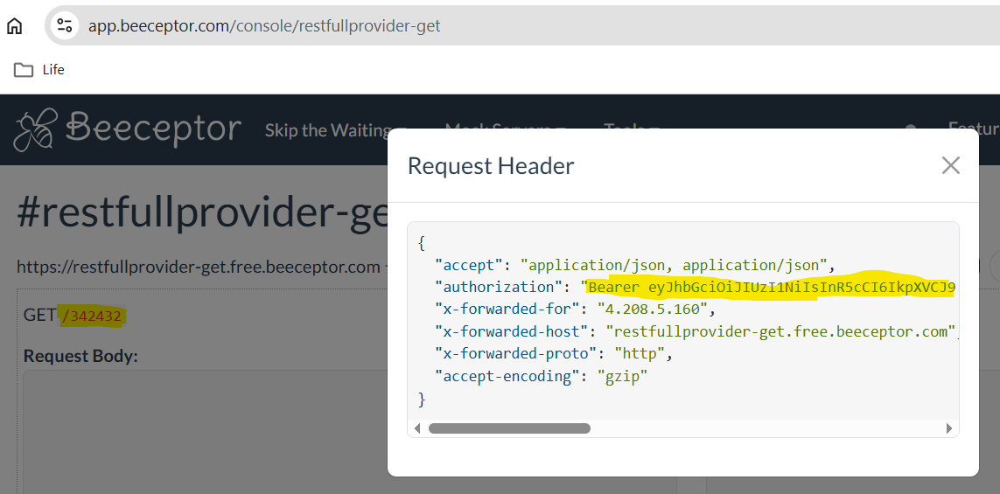

# Description

Custom policies gets:
- `message`
- `bearerToken`

from the user and send them to mock server
- http://restfullprovider-get.free.beeceptor.com/{message}

`message` is sent in Url and `bearerToken` is sent as `Authorization` header.

You can run custom policy and see result in beeceptor https://app.beeceptor.com/console/restfullprovider-get:
- it gets `message` from Url
- and Authorization header

[x] Visual Studio

[x] Simple hello

[x] Prepare mock on https://free.beeceptor.com

[x] PoC on passing values in GET

[ ] PoC on passing Correlation ID
